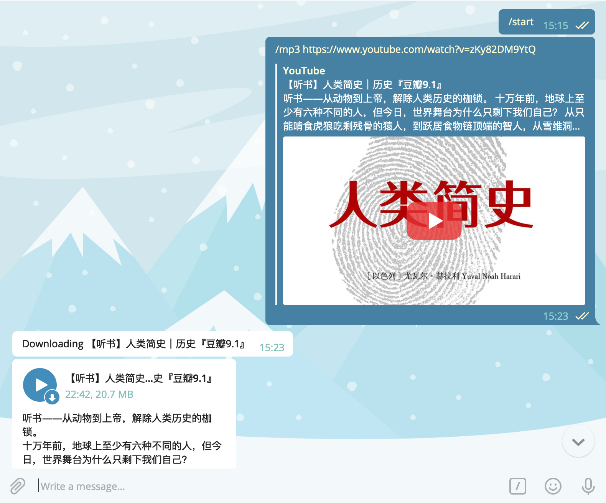

# Youtube MP3 bot

Listen to Youtube videos via Telegram



## Prerequisites

To run this bot, you need to have a local installation of FFmpeg present on your system. You can download it from https://www.ffmpeg.org/download.html

## Getting Started

```
$> npm i -g youtubemp3bot
$> youtubemp3bot -t Bot_token
```

## Telegram Commands

| Commands | Description | Example |
|---|---|---|
| mp3 | Convert the Youtube video to MP3 | `/mp3 kR_8l6YgY8Q` or `/mp3 https://www.youtube.com/watch?v=kR_8l6YgY8Q` |

## Notes

1). Telegram bot has a file size limit for sending in 50MB. 

2). Default MP3 Bitrate: 128 Kbps

3). To convert a 10 minutes video may need 10 minutes.

## LICENSE

MIT ©️ Copyright UnsignedInt8